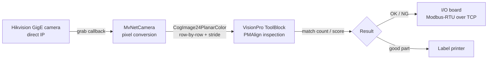

[中文](README.md) | **English**

   

# Machine-Vision Inspection HMI (Hikvision GigE + VisionPro)

> 一套在产线上长期稳定运行的视觉检测程序。Full Chinese comments included. A WinForms application that has run on real production lines for years: Hikvision camera capture, Cognex VisionPro ToolBlock inspection, network I/O control, and label printing — the whole chain, in one place.

## What problems it solves

If you've paired a Hikvision camera with VisionPro, you've probably hit these. Each one has a concrete fix in the code:

| Common field problem | How this code handles it |
|---|---|
| Old SDK camera enumeration returns -16 | No enumeration. The app opens the camera by IP from an ini file — change config, not code |
| Camera won't open after a killed process (0x80000203) | The camera keeps the session for ~1.5–2 min. The app auto-retries 40 × 3 s to ride it out |
| Industrial pixel formats (Mono12_Packed…) won't feed VisionPro | Convert via PixelTypeConverter to RGB8, then write into CogImage24PlanarColor row by row with stride alignment |
| Editing the inspection recipe requires downtime | The UI embeds CogToolBlockEditV21 — train PMAlign, tune and save the vpp on the line; both old and new vpp layouts load |

## Data flow



## Repository layout

```
.
├── README.md / README.en.md
├── 采图检测流程说明.md      # full walkthrough, in code-execution order (Chinese)
└── src/
    ├── VisionDemo.csproj    # opens in VS2019+
    ├── app.config
    ├── Program.cs / Settings.cs / IniFile.cs / UIHelper.cs
    ├── FormMain.cs / FormToolblock.cs / FormSplash.cs (+ Designer + resx)
    ├── MvNetCamera.cs       # new Hikvision SDK wrapper: IP direct + pixel conversion
    ├── IIOBoard.cs / NetIOBoard.cs / IOBoardTestForm.cs   # I/O comms (hand-written CRC16)
    ├── LabelPrinter.cs
    └── Properties/
```

## Build & run

1. Install Hikvision MVS (new SDK) and Cognex VisionPro 9.x;
2. Open `src/VisionDemo.csproj` in VS2019+, point the references at your local VisionPro install, build;
3. Camera IP, NIC IP and exposure live in the `[相机]` section of `data\sys.ini` (defaults: 192.168.1.100 / 192.168.1.20);
4. No camera? The app still runs — you can explore the UI and the embedded ToolBlock editor.

## FAQ

- **Which cameras are supported?** Hikvision MV-CS series GigE cameras via the new MvCameraControl.Net SDK (SDKSystem.Initialize → DeviceFactory.CreateDeviceByIp → StreamGrabber).
- **How do I change the inspection logic?** Edit the vpp ToolBlock on the UI and save; the app parses PMAlign results per tool on load — see `FormMain.cs`.
- **What's the I/O protocol?** Modbus-RTU over TCP with a hand-written CRC16; every frame is commented, easy to adapt to another board.
- **Label printing?** `LabelPrinter.cs` uses a generic template-replacement approach for label printers; templates are plain editable text.

## About the full version

This repo is the showcase edition — the core chain is complete. The full version adds the complete walkthrough document, per-module explanations and a customization guide. It's being listed on mianbaoduo and CSDN:

- CSDN field notes (Chinese): [Hikvision camera connection troubleshooting] (https://blog.csdn.net/csdngouwei/article/details/166601561)
- Mianbaoduo full package: link will be added once listed, or ask via CSDN private message
