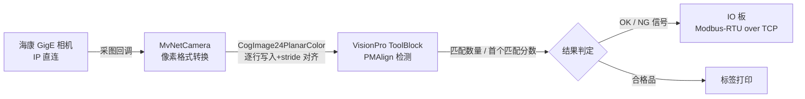

**中文** | [English](README.en.md)

   

# 机器视觉检测上位机（海康 GigE 相机 + VisionPro）

> WinForms machine-vision app for real production lines: Hikvision GigE capture → Cognex VisionPro ToolBlock inspection → network I/O board → label printing. Full source with line-by-line Chinese comments.

一套在产线上长期稳定运行的视觉检测程序：相机采图、VisionPro 检测、IO 板联动、标签打印，整条链路的源码都在这个仓库里，中文注释一行没删。

## 这套代码解决什么问题

用海康相机接 VisionPro 的人，多半踩过下面几个坑。这里每个坑都有对应的解法，直接看代码：

| 现场常见问题 | 这套代码的做法 |
|---|---|
| 旧版 SDK 枚举相机返回 -16 | 不走枚举，按 ini 配置的 IP 直连打开相机，换现场只改配置不改代码 |
| 程序被强杀后相机打不开（0x80000203） | 相机侧会话残留约 1.5–2 分钟才释放，代码里自动重试 40 次 × 3 秒，覆盖这个窗口 |
| Mono12_Packed 等工业图像格式进不了 VisionPro | 先经 PixelTypeConverter 转 RGB8，再逐行写入 CogImage24PlanarColor，stride 对齐处理到位 |
| 改检测工具要停机 | 界面内嵌 CogToolBlockEditV21 编辑控件，现场直接训练 PMAlign、调参数、保存 vpp，新旧两种 vpp 结构都兼容 |

## 数据流

从相机出图到打标签，数据是这样走的：



## 目录结构

```
.
├── README.md / README.en.md
├── 采图检测流程说明.md      # 上电到出结果的全流程讲解（按代码执行顺序写）
└── src/
    ├── VisionDemo.csproj    # VS2019+ 直接打开编译
    ├── app.config
    ├── Program.cs / Settings.cs / IniFile.cs / UIHelper.cs
    ├── FormMain.cs / FormToolblock.cs / FormSplash.cs（含 Designer + resx）
    ├── MvNetCamera.cs       # 海康新版 SDK 封装：IP 直连 + 像素转换
    ├── IIOBoard.cs / NetIOBoard.cs / IOBoardTestForm.cs   # IO 板通讯（手写 CRC16）
    ├── LabelPrinter.cs      # 标签打印
    └── Properties/
```

## 编译运行

1. 装海康 MVS（新版 SDK）和 Cognex VisionPro 9.x；
2. VS2019 及以上打开 `src/VisionDemo.csproj`，引用指向本机 VisionPro 安装目录，编译即可；
3. 相机 IP、网卡 IP、曝光在 `data\sys.ini` 的 `[相机]` 节里改，默认 192.168.1.100 / 192.168.1.20；
4. 没有相机也能跑：程序会走打开失败重试流程，界面和 ToolBlock 编辑控件照常可看。

## 常见问题

- **支持哪些相机？** 海康 MV-CS 系列 GigE 相机，走新版 MvCameraControl.Net SDK（SDKSystem.Initialize → DeviceFactory.CreateDeviceByIp → StreamGrabber）。
- **检测逻辑怎么改？** vpp 工具块在界面里现场编辑保存，程序加载后逐工具解析 PMAlign 结果。详细的工具解析代码在 `FormMain.cs`。
- **IO 板是什么协议？** Modbus-RTU over TCP，CRC16 是手写的，报文构造过程全有注释，换 IO 板照着改就行。
- **打印对接什么打印机？** `LabelPrinter.cs` 里是标签机模板替换的通用写法，模板文本可自己改。

## 关于完整版

这个仓库是展示版，核心链路代码齐全。完整版在此基础上补齐《采图检测流程说明》全文、逐模块讲解文档和二次开发指南，在面包多和 CSDN 上架中——需要可以先在 CSDN 蹲一下：

- CSDN 实战博文：[海康相机连接故障排查实战（含本程序的重试设计思路）](https://blog.csdn.net/csdngouwei/article/details/166601561)
- 面包多完整包：上架后在这里补链接，或 CSDN 私信询问
